# Postman 🚀

This folder contains API testing examples created using Postman.

API testing - [here](https://github.com/Serhii-Berezovskyi/QA-Study/tree/main/API/Postman/API%20testing)

## Postman practice ( public API https://petstore.swagger.io/)

- A new pet was added

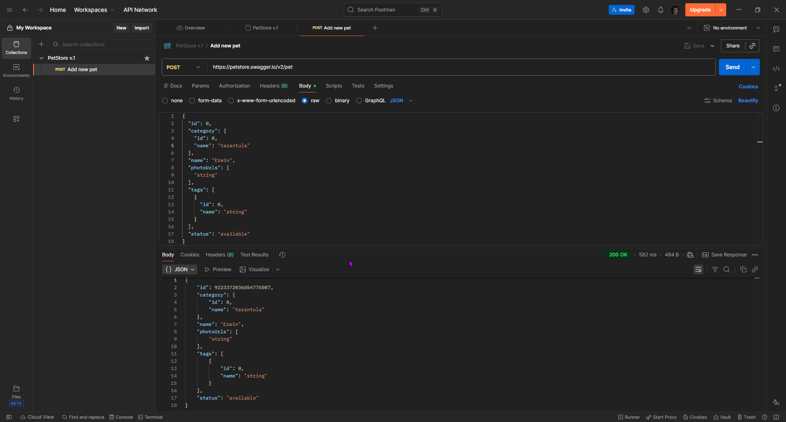

- Finding our animal using the GET request

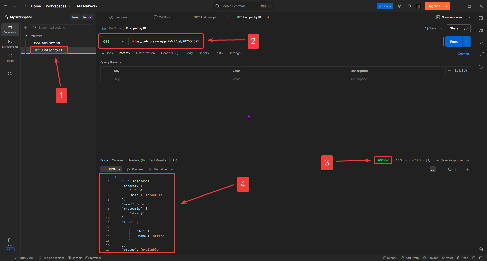

- "petid" variable created

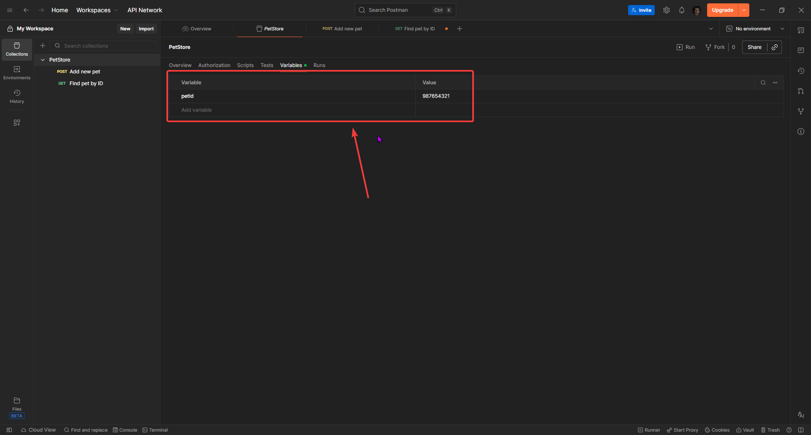

- Update pet information using a PUT request

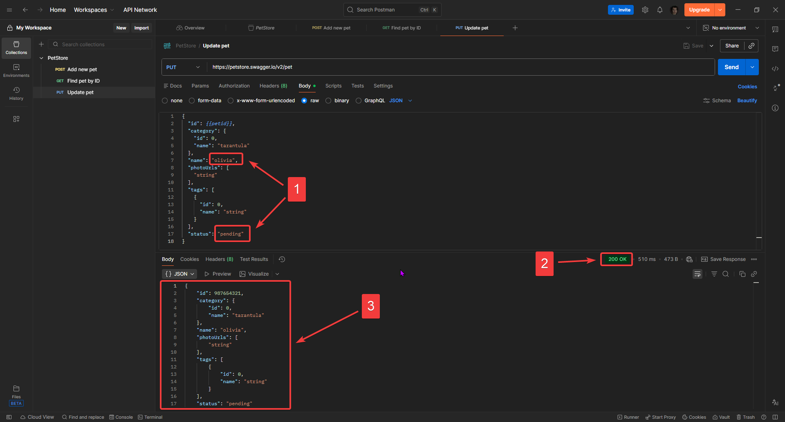

- Checking

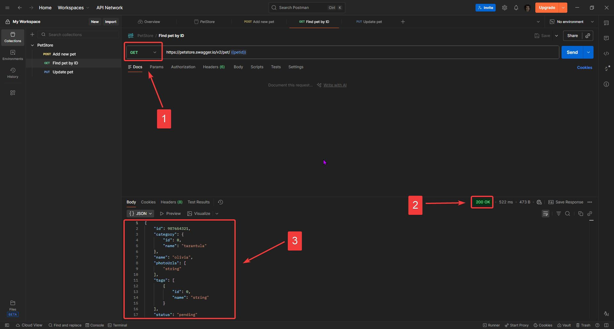

- Delete information about the pet

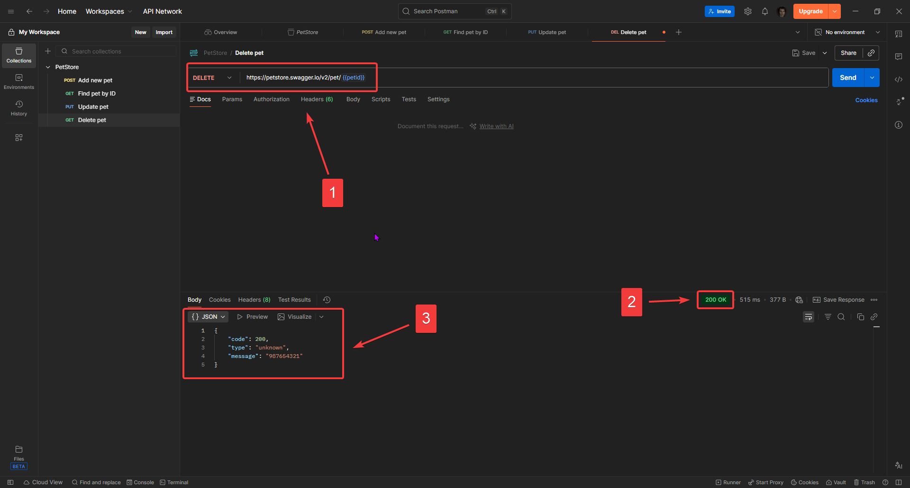

- Checking

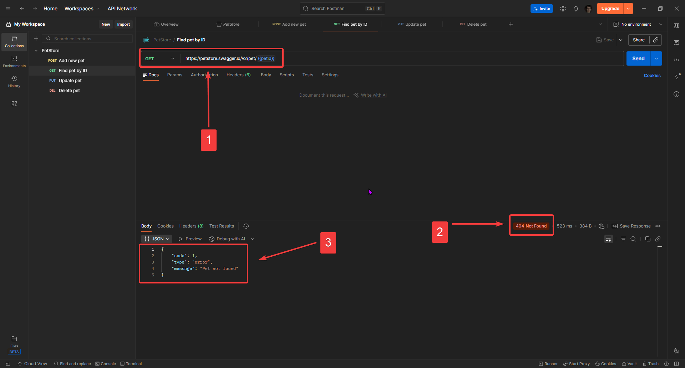

- Find information about pets by status

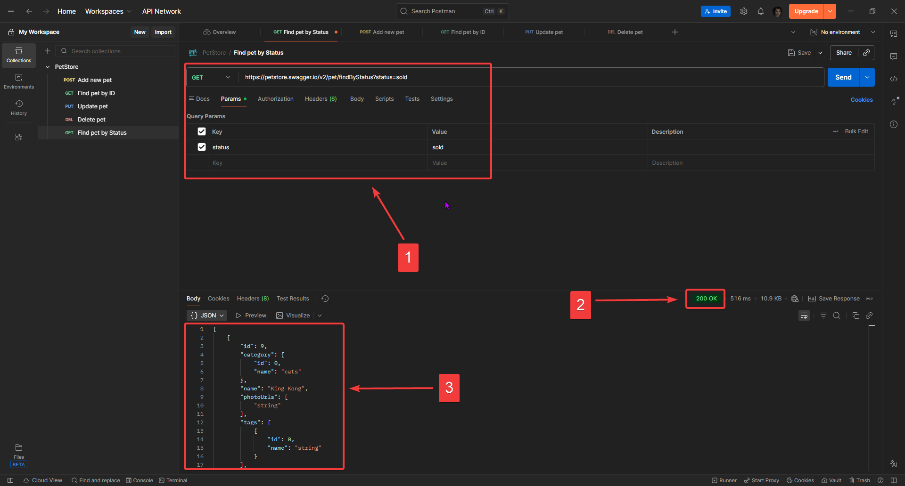

- A new user was added

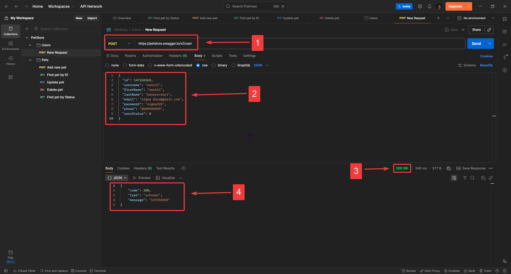

- "userid", "username", "password" variables created

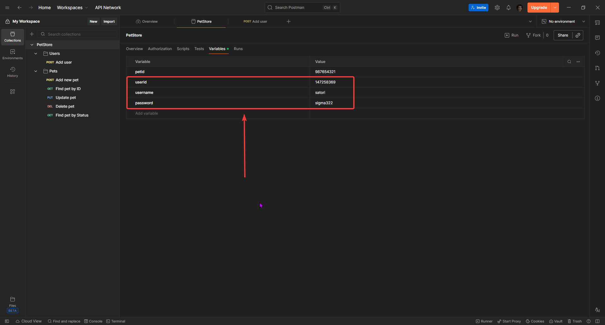

- Let's try to login

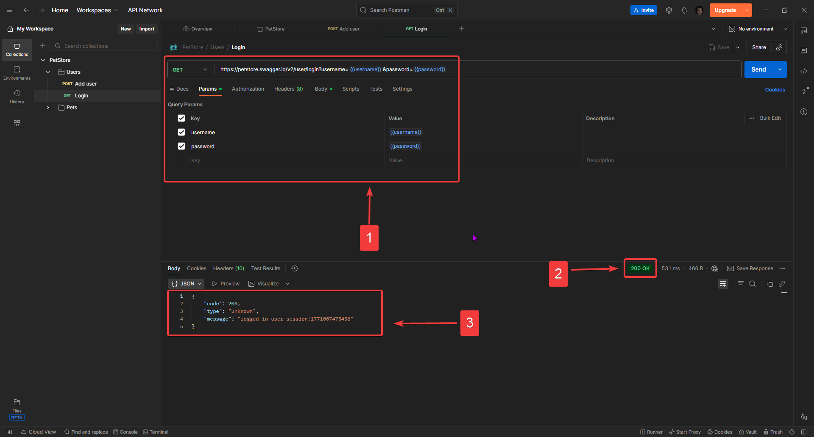

- And now logout

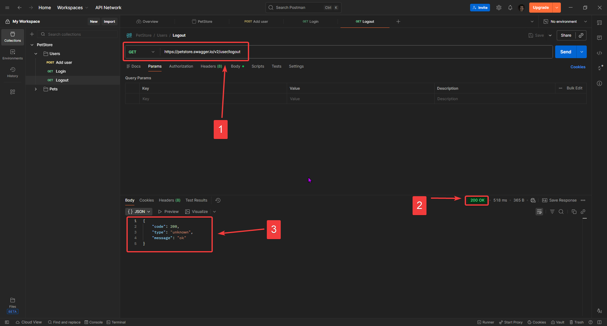
