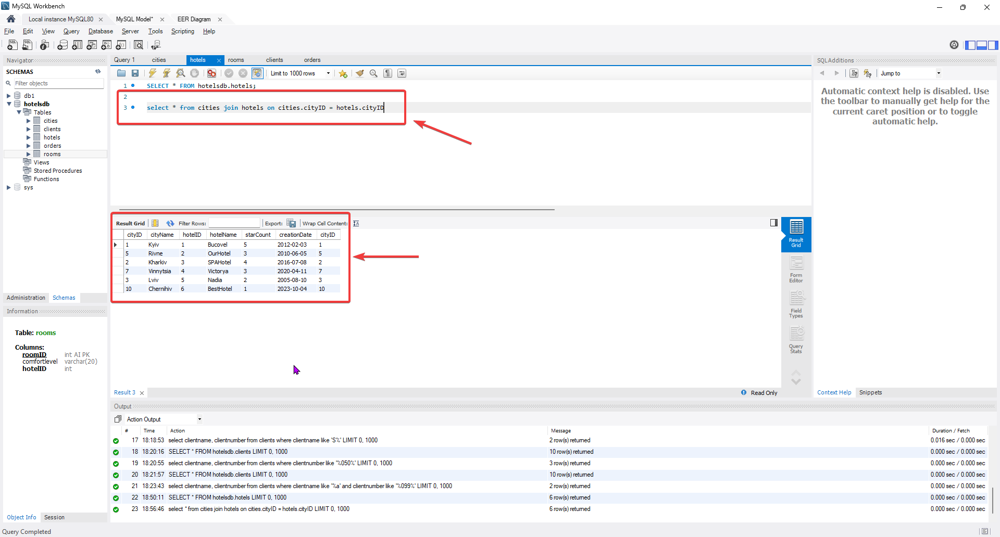
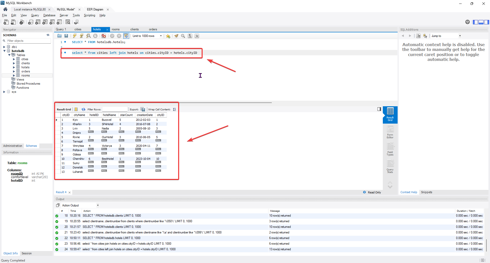
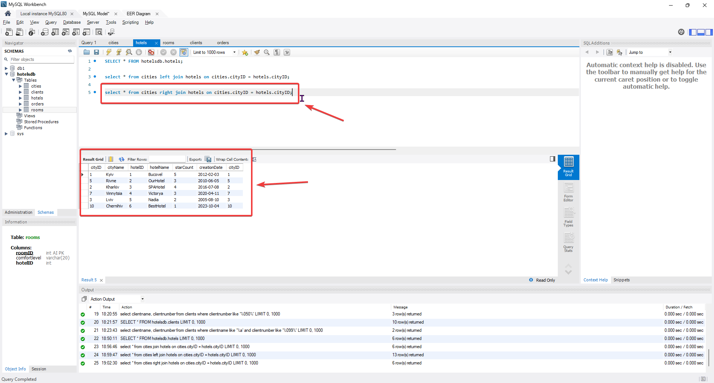
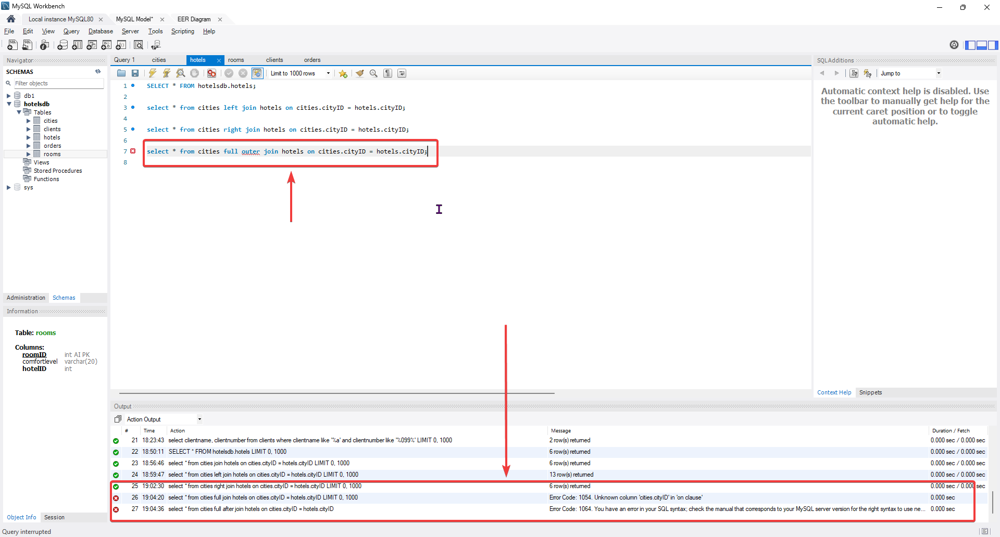
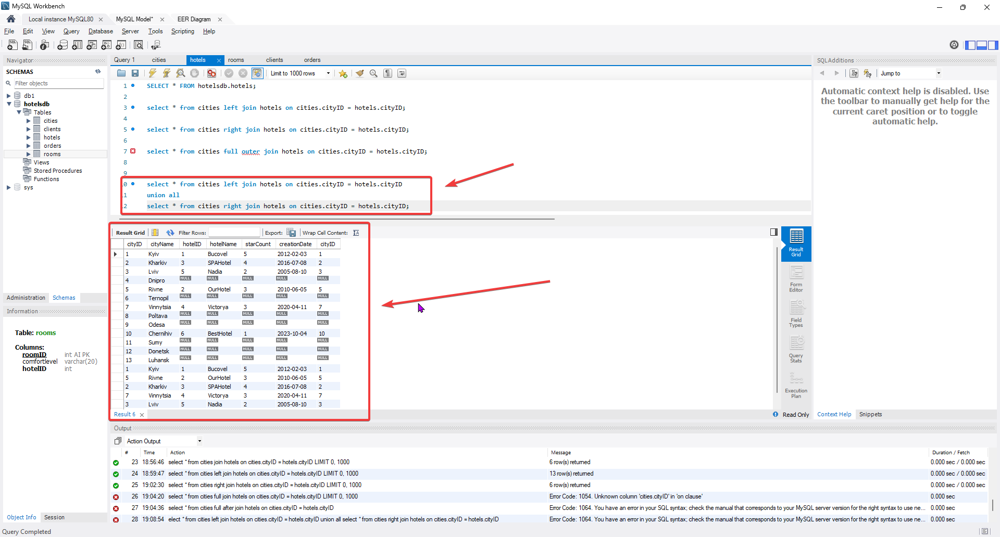
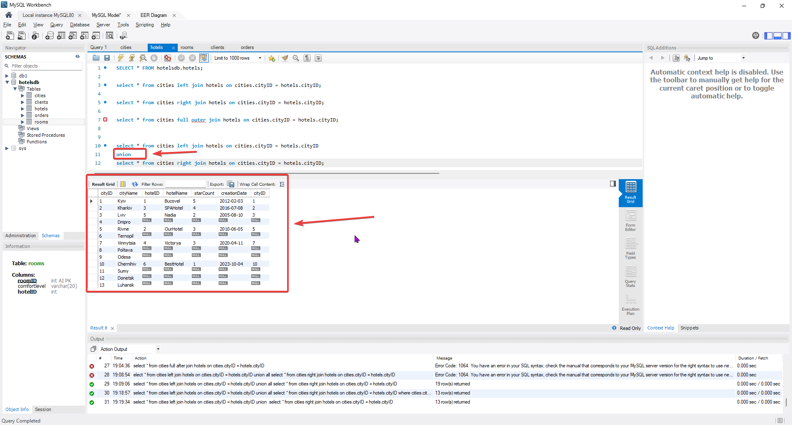

This folder contains JOINS SQL queries

- INNER JOIN

- LEFT JOIN

- RIGHT JOIN

- An attempt to perform a FULL JOIN that doesn`t work in MySQL

- FULL JOIN by using UNION ALL, but with duplicates

- FULL JOIN without duplicates

