# SQL 🗄️

This folder contains basic SQL queries and database practice tasks.

## SQL PRACTICE

- Database created

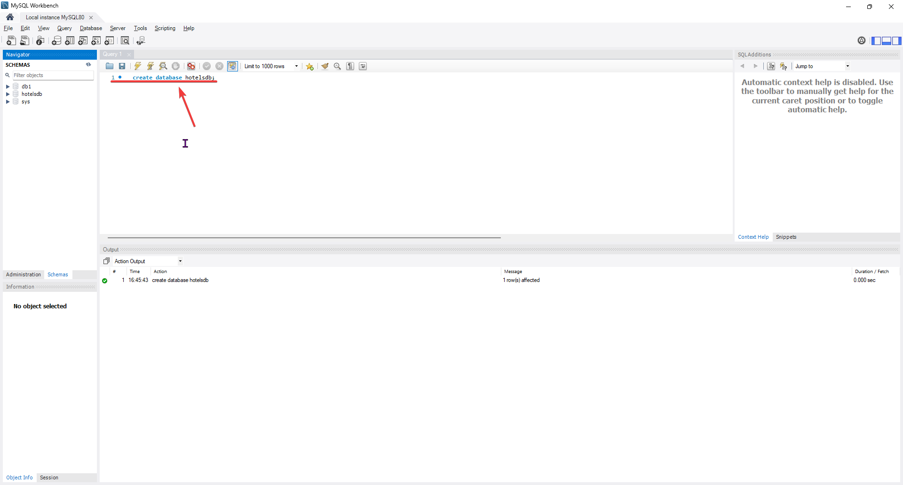

- "Cities" table created

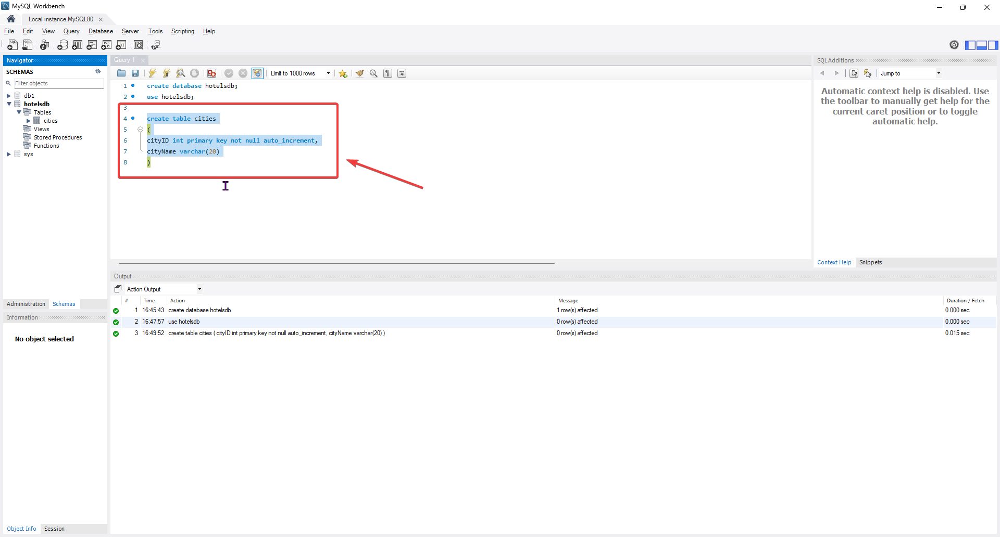

- "Hotels" table created

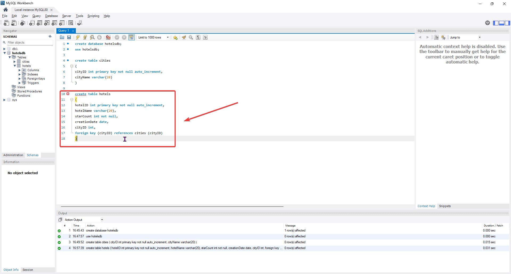

- "Rooms" table created

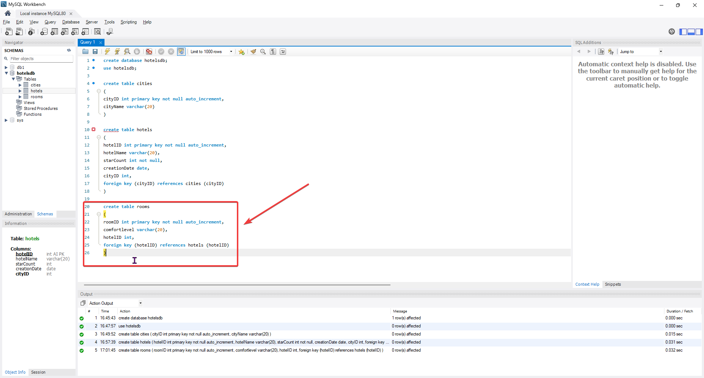

- "Clients" table created

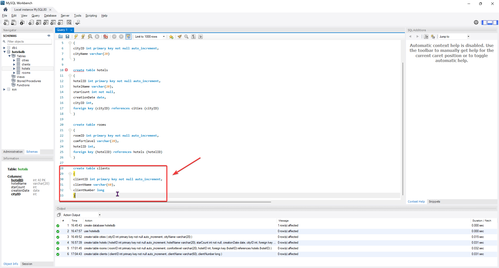

- "Orders" table created

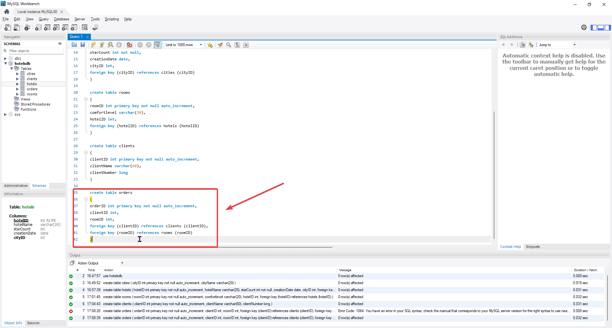

- Database scheme

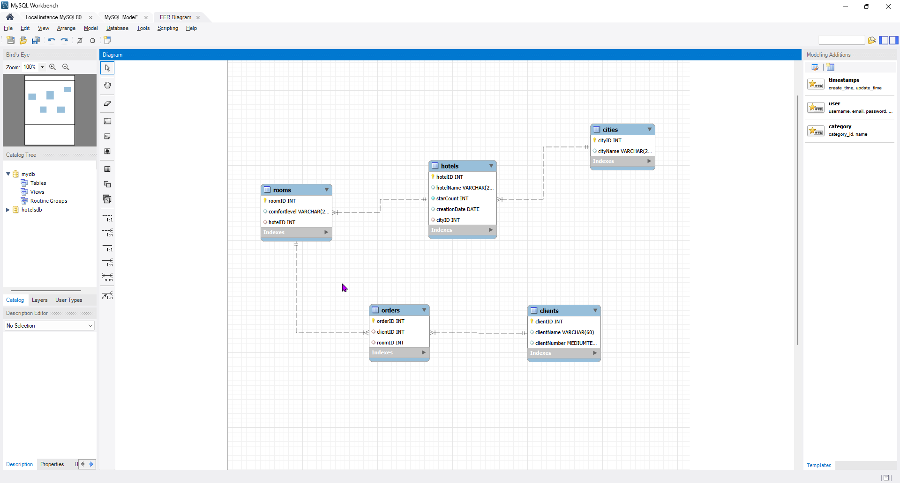

- Filling in database tables

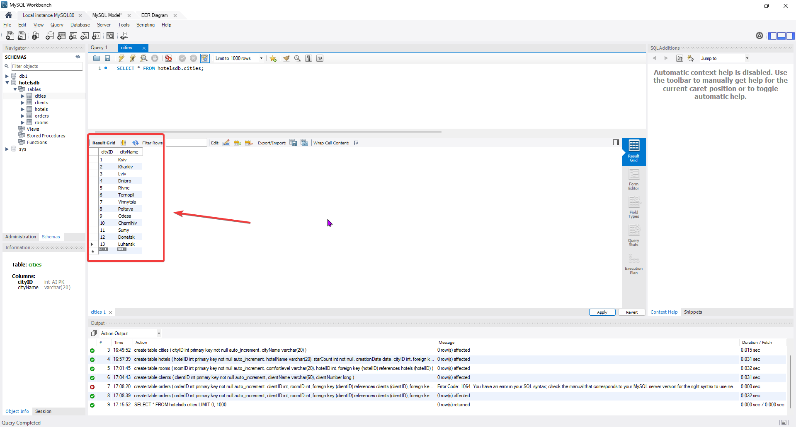

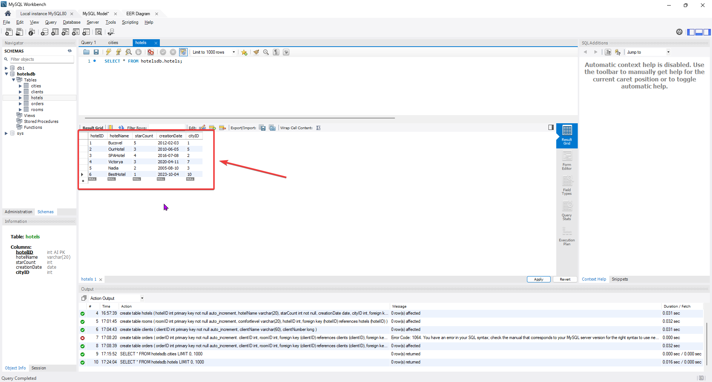

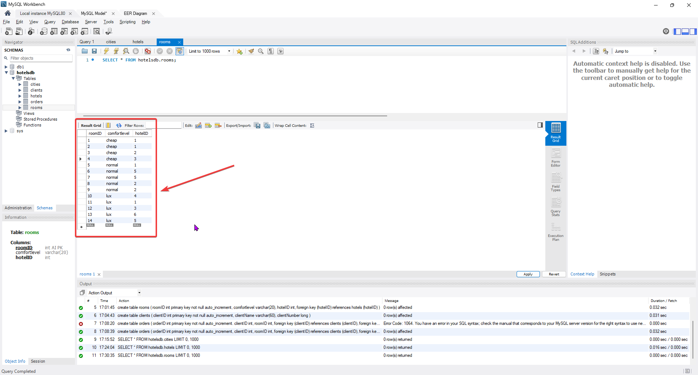

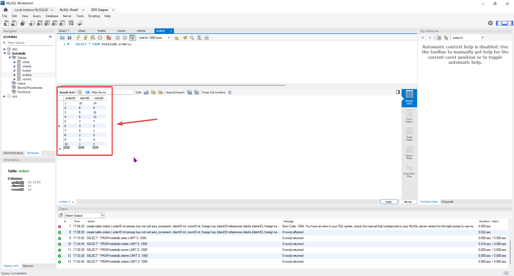

- Practice of using basic queries

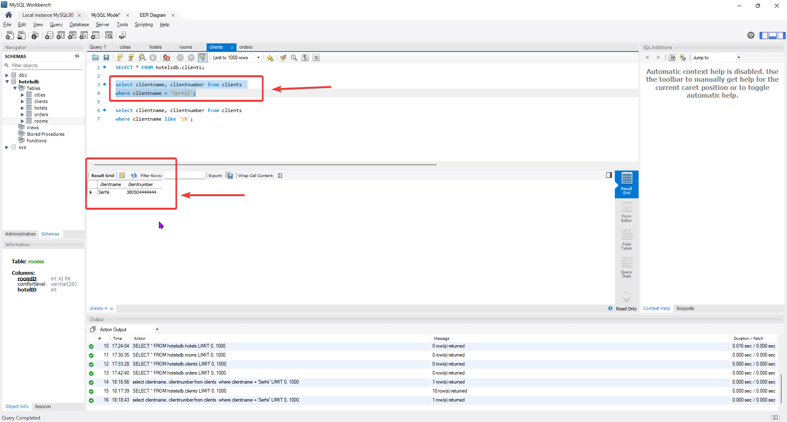

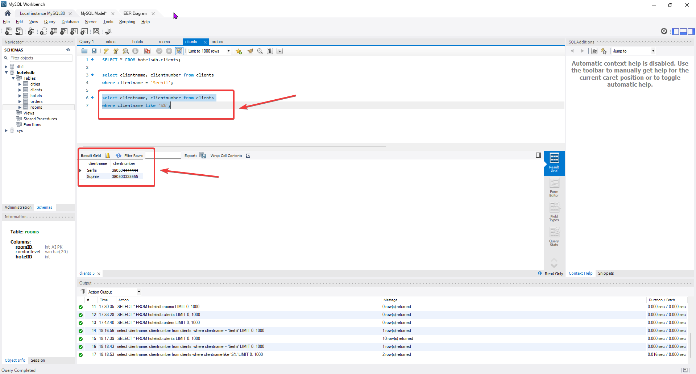

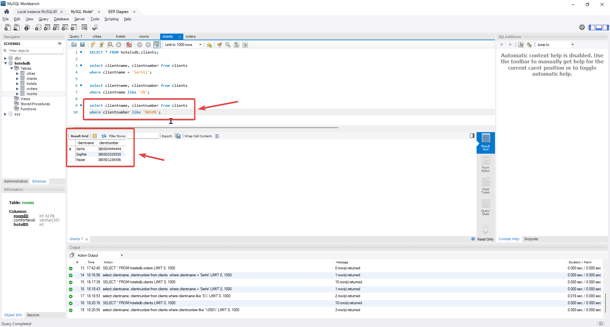

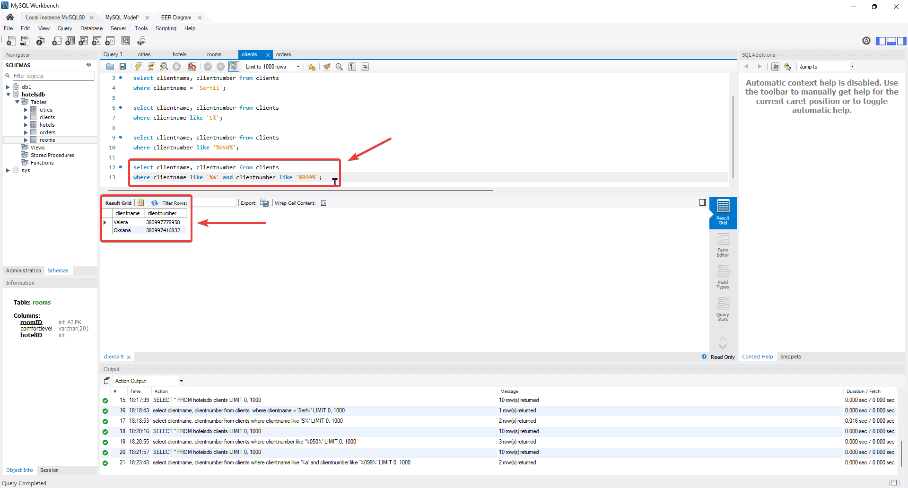
