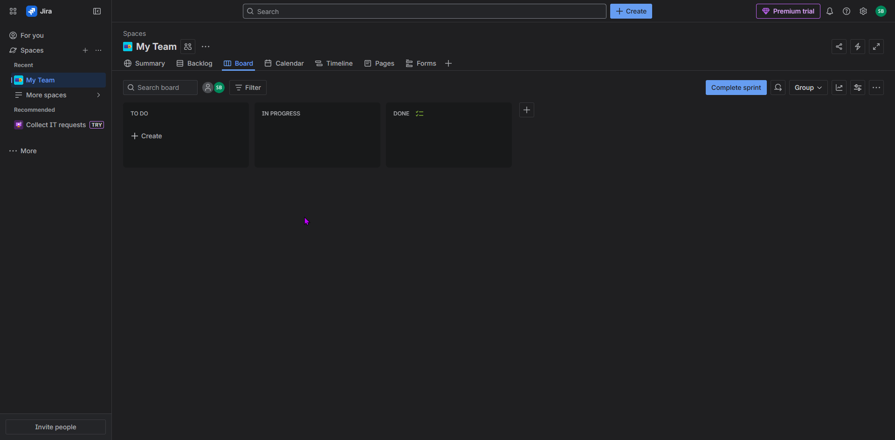
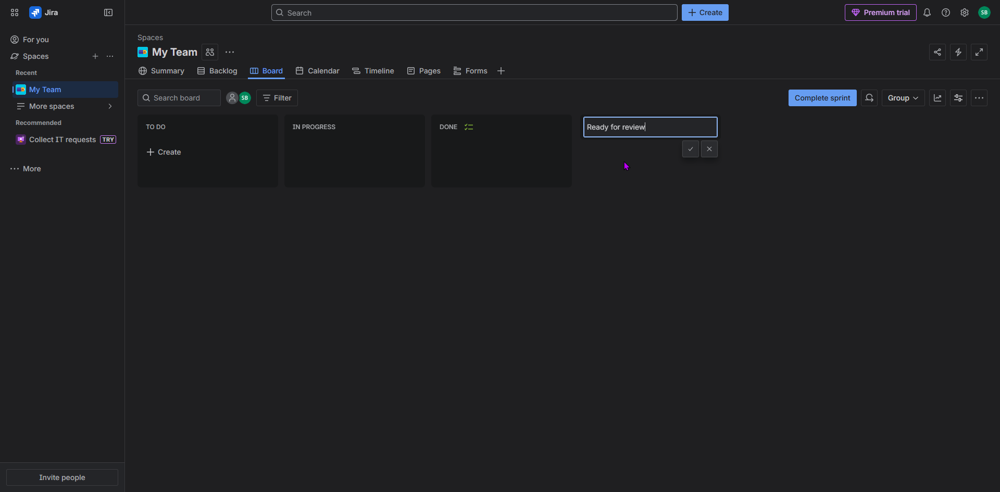
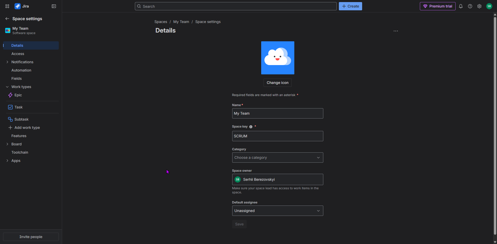
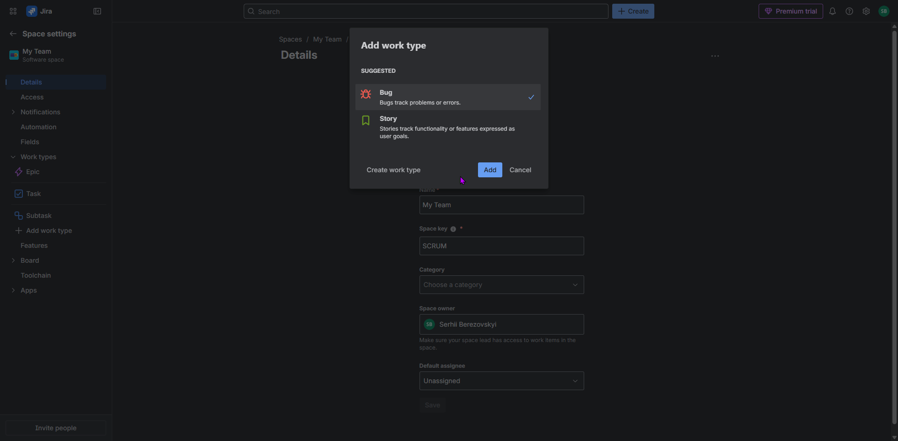
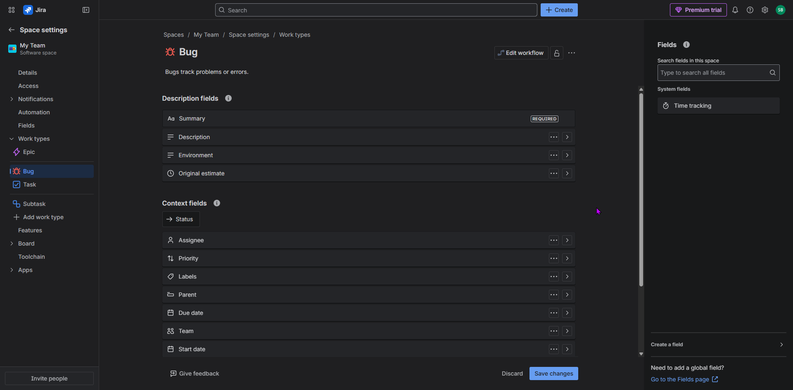
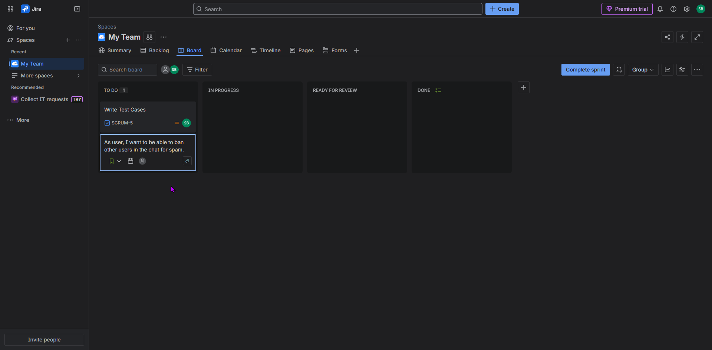
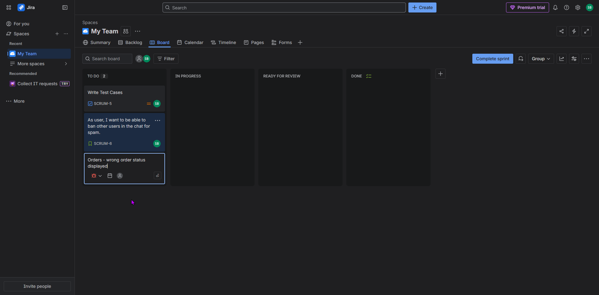
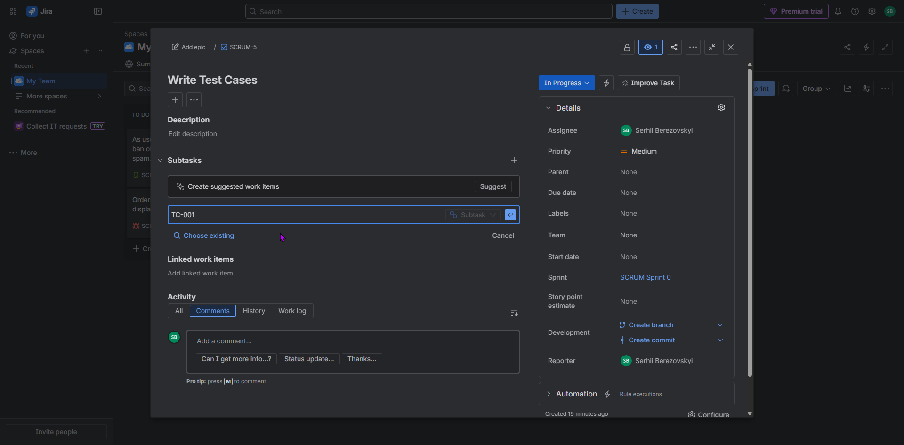

## Jira 📌

This folder includes examples of my practice in Jira.

- SCRUM Board created

- New column added

-  Jira settings

- Adding a Bug feature

- Bug settings

- First task created

- User Story created

- Bug created

- Subtask added 

