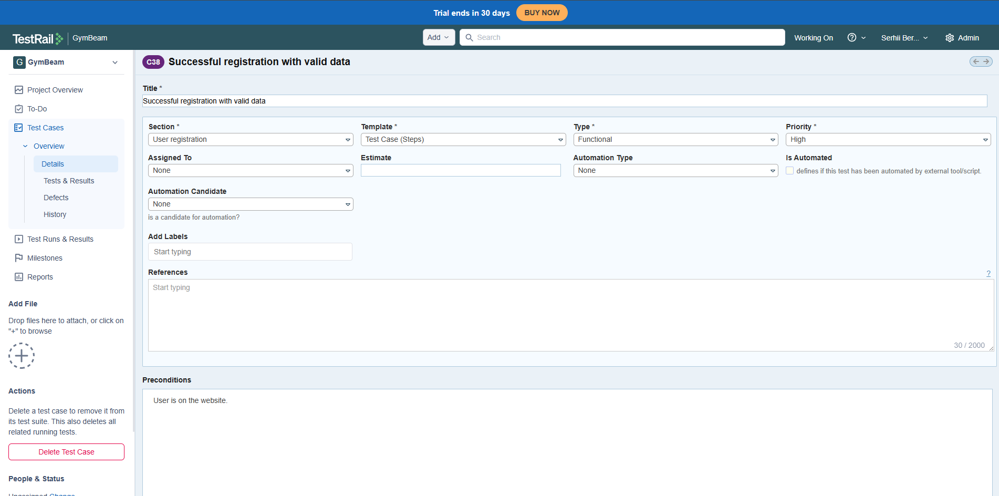
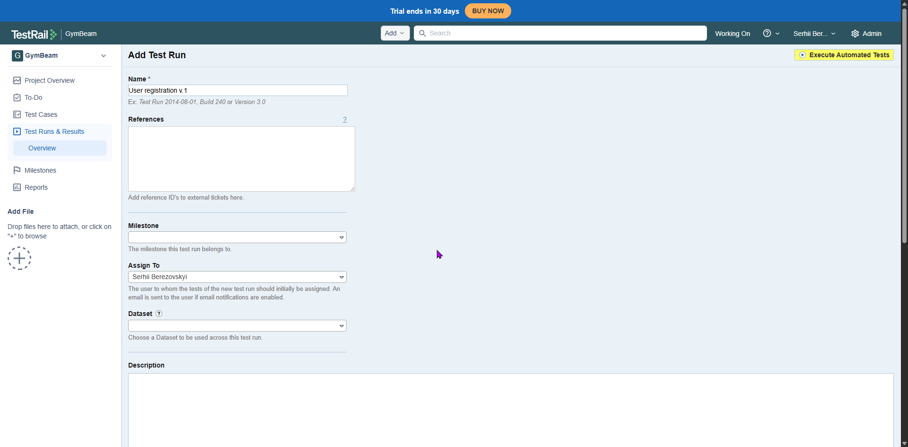

# TestRail 📋

This folder contains examples of test case management using TestRail principles.

- Created project

- Test Suite creation

- First Test Case creation

- Five Test Cases already created

- Test Run creation

- Checking Test Cases

- End of the Test Run

# Results in PDF format, you can find [here](https://github.com/Serhii-Berezovskyi/QA-Study/tree/main/Test-Documentation/Test-Cases).
